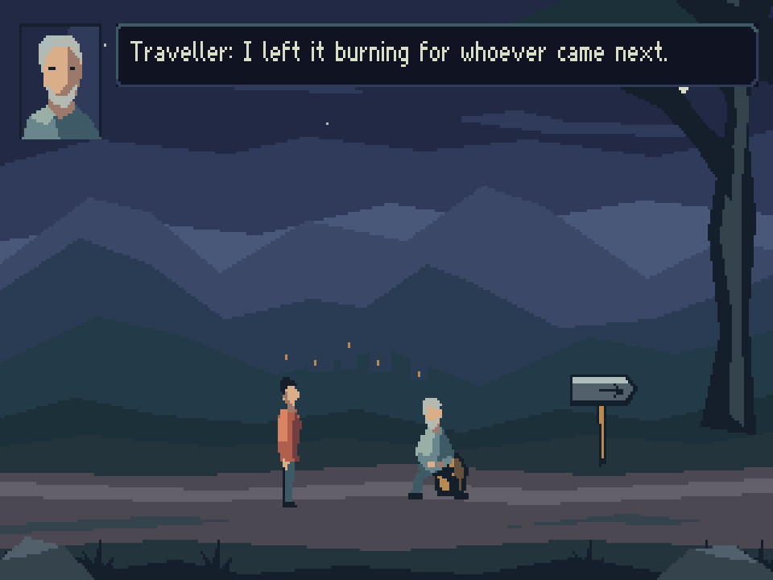
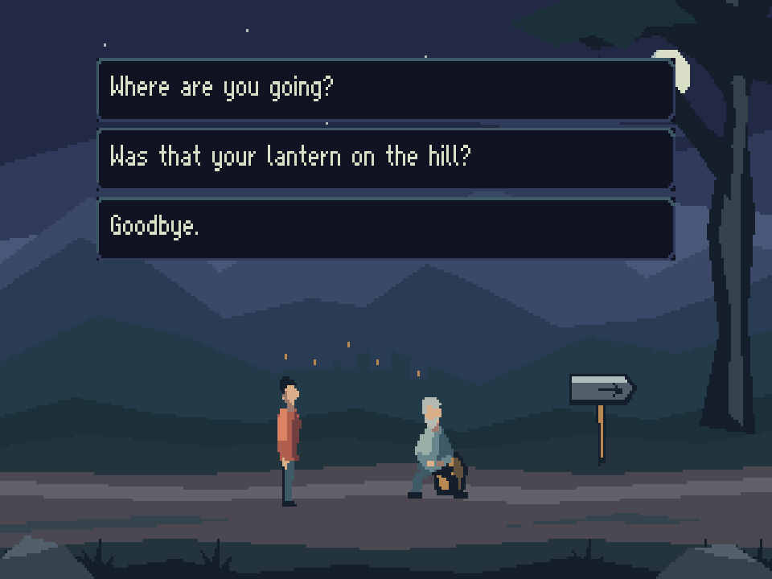
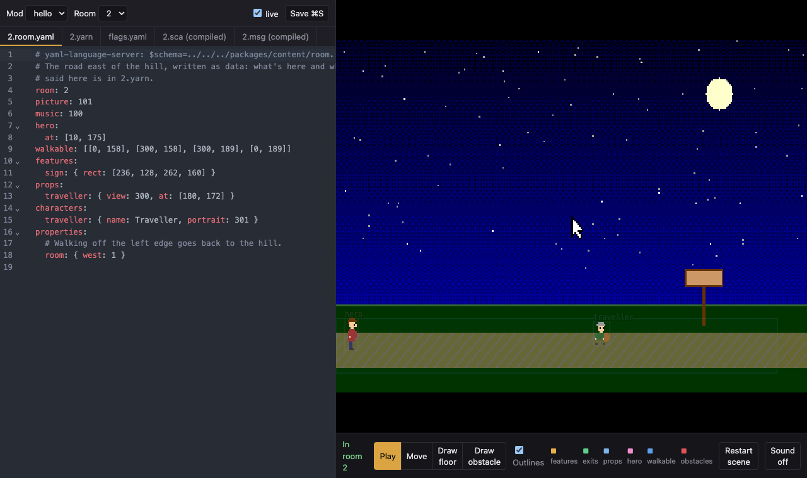
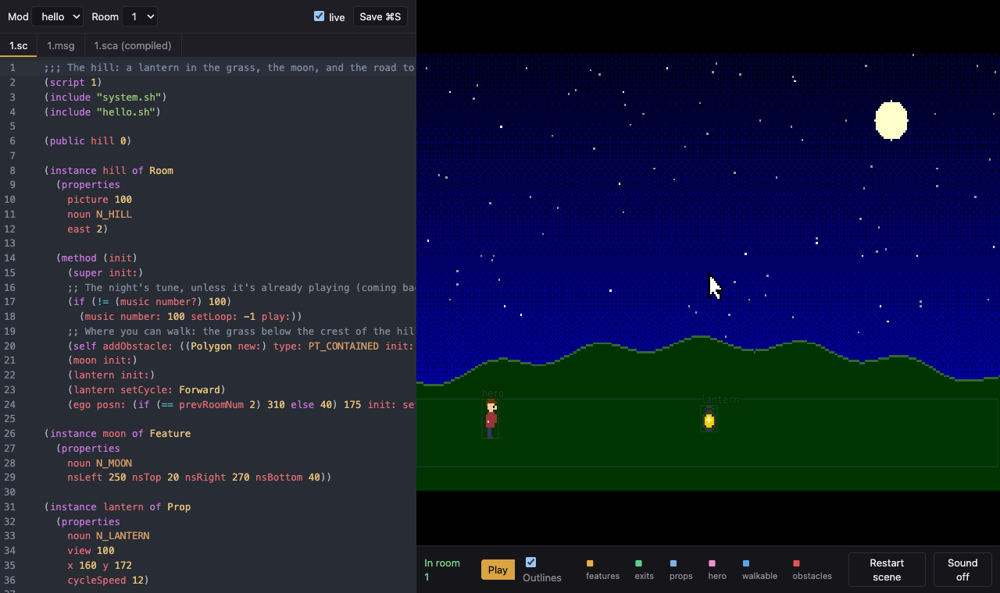
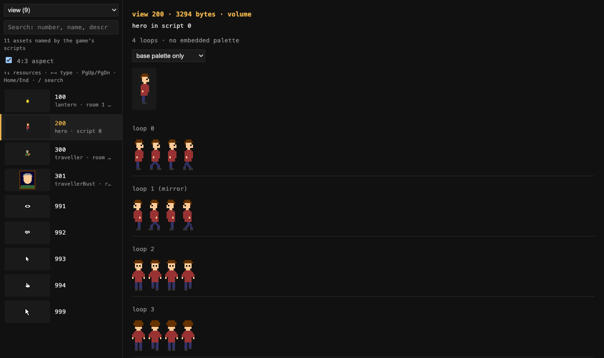
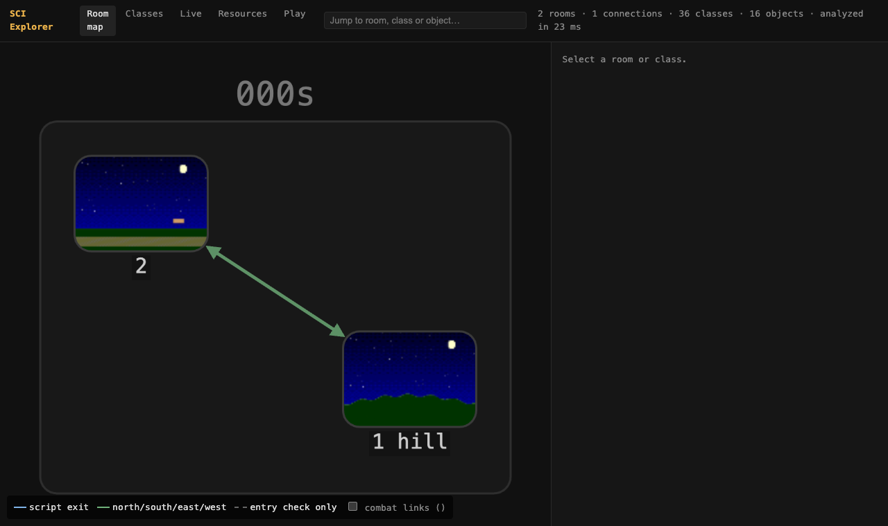

# sci-ts

An engine for Sierra's SCI2 adventure games, written from scratch in TypeScript, and the
tools to make new games with it: scripts in SCI's own Lisp-like language on a class library
of our own, rooms written as YAML and [Yarn](https://docs.yarnspinner.dev), a live editor,
and writers for every kind of resource.



It runs in the browser and in Node. It was built by making one game, *Quest for Glory IV:
Shadows of Darkness* (CD), play from its title screen on, and it now builds games that need
nothing from Sierra: `games/hello` here, and a Sherlock Holmes teaser in progress.

> **No game data here.** This repository contains no files, scripts, art, text or music from
> any Sierra game, and none are needed to build, test or use it. To play a Sierra game, point
> the tools at your own copy. Sierra, Quest for Glory and other names are trademarks of their
> owners and are used only to say what the software works with.

## Make a game

```sh
mkdir night-walk && cd night-walk
npm init -y && npm install --save-dev sci2-ts
npx sci-ts new .          # a room in YAML and Yarn, a hero, placeholder art
npx sci-ts play           # build it and play it in the browser
npx sci-ts edit           # the live editor for its rooms
```

A game is a folder: scripts (`scripts/<n>.sc`), rooms as data (`rooms/<n>.room.yaml` and
`.yarn`), message files, music (MIDI files), sound effects (WAV files), and art drawn in code
or exported from a paint program. `sci-ts build` turns it into the `RESOURCE.MAP` and
`RESOURCE.000` an SCI interpreter opens. See [docs/games.md](docs/games.md).

```lisp
(instance lantern of Prop
  (properties noun N_LANTERN view 100 x 160 y 172 cycleSpeed 12)

  ;; It chimes when touched, then says its line.
  (method (doVerb verb)
    (if (== verb V_DO) (sfx number: 50 play:))
    (super doVerb: verb)))
```


| | |
|---|---|
| [docs/games.md](docs/games.md) | a game's folder, the build, the `sci-ts` command and the package's imports |
| [docs/language.md](docs/language.md) | the script language |
| [docs/library.md](docs/library.md) | the class library: rooms, actors, walking, talking, conversations, flags, sound |
| [docs/rooms.md](docs/rooms.md) | rooms as YAML and Yarn: features, exits, characters, topic menus, cutscenes |
| [docs/art.md](docs/art.md) | art from a paint program: the manifest, the palette, the checks |

## The tools

**The player** plays a game in the page: saved games, a link to any room
(`play.html#room/2`), music through a SoundFont or an emulated AdLib card.



**The live editor** shows a room's YAML and Yarn, or its script, next to the running game.
Saving (or a pause in typing) rebuilds the game and walks into the room again; errors are
marked on their line. Outlines name the features, exits, props and walkable floor; in Move
mode things are dragged into place and floors painted with a brush, as edits to the YAML.





**The resource viewer** lists every resource with a thumbnail and the name the game's
scripts give it, searchable, with a player for sounds.



**The explorer** maps a game's rooms and how they connect, its classes and objects, and
inspects a running game.



**On the command line:** `sci-ts build`, `play`, `edit`, `new`, `site` (the game and its
docs as a static site) and `art` (check and build exported art). The compiler warns about
sends no class defines; `editors/vscode` highlights the language in VS Code.

## Inside

| | |
|---|---|
| `packages/sci` | the engine: resources, the SCI2 virtual machine and its kernel, graphics, text, motion, sound, saves; readers and byte-exact writers for every resource; the script compiler and assembler |
| `packages/content` | the room compiler: YAML and Yarn to scripts and messages |
| `lib` | the class library, in the script language |
| `apps/viewer` | the player, editor, resource viewer and explorer |
| `tools` | the `sci-ts` command, the game build, the art tool, and tools for reading SCI2 games |
| `games/hello` | the example game |

How SCI works, as far as we found out by running a game: [docs/sci](docs/sci/README.md).

## Developing sci-ts

```sh
pnpm install
pnpm check                 # typecheck and tests; no game files needed
pnpm game build games/hello
SCI_GAME=out/games/hello pnpm viewer
```

With an SCI2 game of your own in `original/` (or `SCI_GAME=<dir>`), `pnpm viewer` opens it,
and `pnpm res`, `pnpm asm`, `pnpm msg` and `pnpm play` read, disassemble and run it.

See [docs/plan.md](docs/plan.md) for where this is going and [CONTRIBUTING.md](CONTRIBUTING.md)
for how to help. Changes are in [CHANGELOG.md](CHANGELOG.md), generated from commit messages.

## License

MIT. See [LICENSE](LICENSE).
