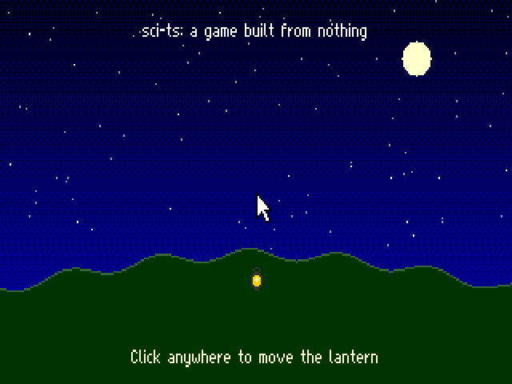

# Making a game

A game is a folder under `games/`. `pnpm game build games/<name>` turns it into the two files
an SCI interpreter opens, `RESOURCE.MAP` and `RESOURCE.000`, in `out/games/<name>`:

```sh
pnpm game build games/hello
SCI_GAME=out/games/hello pnpm viewer      # then open /play.html
SCI_GAME=out/games/hello pnpm play --frames 60 --png-every 60
```



## What's in a game folder

```
games/hello/
  scripts/0.sc       script 0: exports the game object
  scripts/999.sc     more scripts, any numbers
  resources.ts       optional: pictures, views and anything else made in code
```

**Scripts** are written in SCI's Lisp-like language ([language.md](language.md)), as
`scripts/<n>.sc`. A script can also be hand-written assembly (`scripts/<n>.sca`, described
at the top of `packages/sci/src/script/assembly.ts`), and the two can use each other's
classes. Script 0's first export is the game object, and the interpreter starts the game by
sending it `play`.

**resources.ts** default-exports a function returning resources (`{ type, number, data }`).
It imports what it needs from `tools/game/kit.ts`: the writers for pictures, views, fonts and
palettes, and the base palette's colours. `games/hello/resources.ts` draws a picture and a
view pixel by pixel.

**Defaults.** Unless the game makes its own, the build adds:

| resource | what |
|---|---|
| font 0 | a pixel font, 10 pixels a line, ASCII 32 to 126 (`tools/game/font.ts`) |
| palette 999 | the base palette: 16 basic colours, a 6×6×6 colour cube from 16, greys from 232, 254 for transparency, 255 white |
| view 999 | an arrow cursor with its hotspot at the tip |

`cube(r, g, b)` in the kit gives the colour-cube index nearest an RGB colour.

## What the build does

1. Compiles the `.sc` scripts together and assembles them and any `.sca` scripts. Classes
   come from the scripts themselves; a class name nobody defines is reported with its file
   and line.
2. Numbers selectors as the scripts use them, starting with the nine slots every object
   begins with (`-objID-` to `name`), and writes them to vocab 997.
3. Writes vocab 996, which says which script defines each class (by species number, which
   each class declares).
4. Adds `resources.ts`'s resources and the defaults, and refuses any resource made twice.

## Classes the interpreter works with

Until there's a class library, a game defines its classes. The interpreter reads
properties by name, so a class works with a kernel as long as it has the properties the
kernel reads. `games/hello/scripts/0.sc` has the minimum for a plane (`priority`,
`inLeft`...`inBottom`, `picture`, `back`), a screen item (`x`, `y`, `view`, `loop`, `cel`,
`plane`, `bitmap`, ...), text drawn by `CreateTextBitmap`, and an event.
